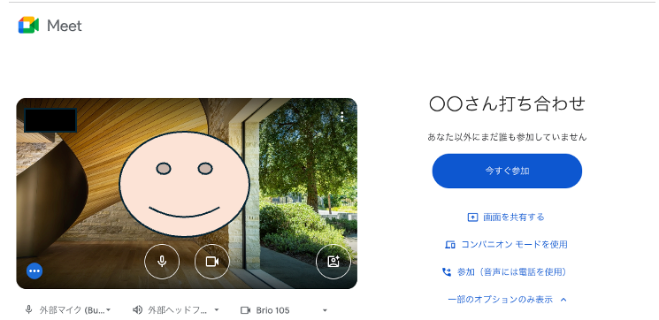

GoogleカレンダーWeb会議自動起動ツール(gcal-run)
======================

### これは何？

GoogleカレンダーにあるWeb会議のイベントを定期的にチェックし、開始前に自動的にブラウザで起動するツールです。

Web会議の開始時間を忘れがちな人にオススメです。

会議の開始2分前になると、ブラウザが自動的に起動し、以下のような会議に参加する前の画面になります。

## 説明

* インストールするとMacOSのLaunchAgentsの機能を用いて常駐プロセスとして動作します。OS再起動後も自動的に動作開始します。
* Googleカレンダーをチェックし、2分前に開始するGoogleMeet、Zoom、もしくはMicrosoft Teamsの会議のURLがある場合、そのURLをブラウザで開きます。
* 一度起動した会議は内部に記録しておき、再度起動しないようになっています。
* 30秒ごとにカレンダーをチェックします。
* 「何分前にブラウザで起動するか」や「起動するブラウザ」はインストール時の設定で変更できます。

### 対象となるカレンダーイベントの条件

カレンダーのイベントがオンライン会議かとうか判定は以下の通り

判定条件

* 条件１：オンラインミーティングの設定がされていてボタンが有る場合、設定されたURLを採用
* 条件２：会議の場所に対象のURL(※)が含まれる場合それを採用
* 条件３：本文に対象のURL(※)が含まれる場合それを採用

 

(※) 対象のURL

* https://meet.google.com
* https://zoom.us
* https://teams.microsoft.com/l/meetup-join

## インストール方法

* [Macでのインストール方法](./doc/INSTALL_MAC.md)
* [Windowsでのインストール方法](./doc/INSTALL_WINDOWS.md)

## その他

- [リリースノート](doc/RELEASE_NOTE.md)